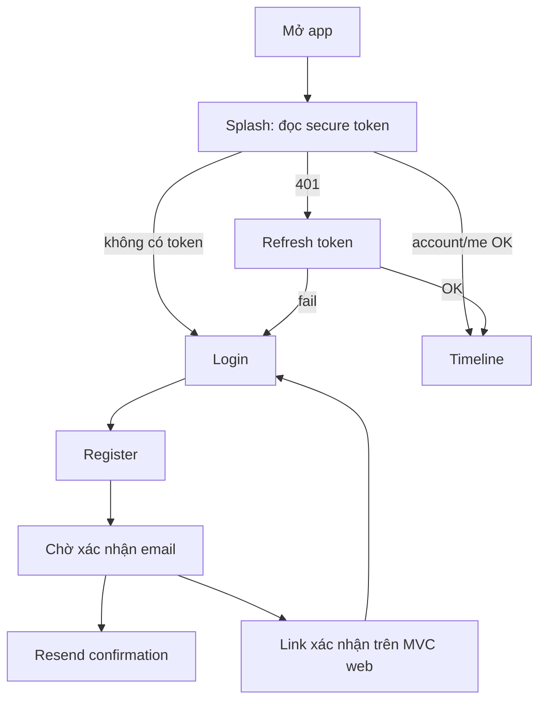
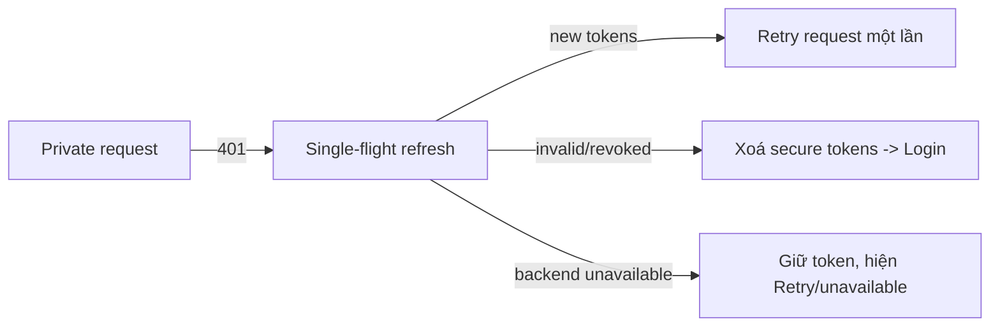

# Luồng người dùng Mobile

## Phase 19E Checkpoint 2C

Album flow is Information -> optional Memory selection -> Confirmation -> one atomic `POST /api/v1/albums`. Details can open an included Memory and Edit changes only name/description. Membership actions after creation and delete/Undo remain deferred.

## First launch, đăng ký và xác nhận



## Login, refresh và unavailable backend



## Tạo Memory có/không có ảnh

```mermaid
flowchart TD
  Form[Create form] --> SaveText[POST Memory]
  SaveText -->|success, không ảnh| Detail[Memory details]
  SaveText -->|success, có ảnh| Upload[POST images/{memoryId}]
  Upload -->|201| Detail
  Upload -->|lỗi| Partial[Text đã lưu; giữ preview]
  Partial --> Retry[Retry cùng Memory ID]
  Retry -->|success| Detail
  Partial --> Continue[Tiếp tục không có ảnh]
  Continue --> Detail
```

**Manual QA pending:** kiểm tra thật Android Photo Picker cho nhánh Partial -> Retry trên thiết bị/emulator được hỗ trợ còn chờ do API 36 native splash/black-screen rendering.

## Các flow private còn lại

- **Edit Memory:** Details -> Edit -> `PUT /memories/{id}` -> upload các ảnh mới sau text save -> Details. Retry không lặp `PUT` thành công.
- **View private image:** Detail/gallery -> Bearer content request -> bytes trong memory -> render. Không có public URL/disk cache vĩnh viễn.
- **Delete individual image:** confirm -> `DELETE /memories/{memoryId}/images/{imageId}` -> row và file bị xoá; lặp lại nhận `404` an toàn.
- **Soft-delete/restore Memory:** delete -> resource ẩn khỏi normal query và image content trả `404`; restore -> nhìn thấy lại và image access được khôi phục.
- **Albums:** create/manage là **Planned**, không có Flutter flow đã triển khai. Backend đảm bảo chỉ cùng owner và Memory chưa xoá mới tham gia Album.
- **Logout/account switch:** gọi logout nếu có refresh token -> xoá token local; provider ảnh gắn `userId` bị vô hiệu, không mang private image sang account tiếp theo.
