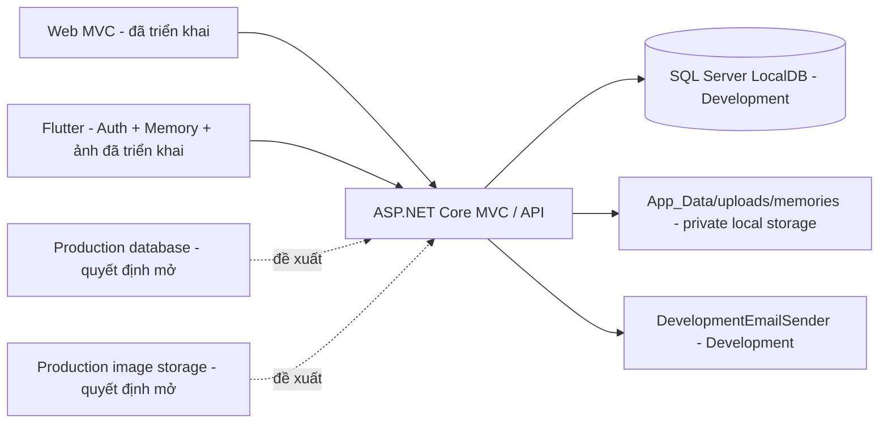

# Kiến trúc sản phẩm MemoLens

## Phạm vi và nguồn sự thật

MemoLens là nhật ký ảnh riêng tư, không phải mạng xã hội. Tài liệu này phân biệt rõ: **đã triển khai** được kiểm tra từ mã nguồn, **đã ghi nhận trong tài liệu**, **dự kiến**, và **quyết định mở**. Không có feed công khai, likes, comments, followers, public profile, public sharing hay AI trong phạm vi hiện tại.

## Nguyên tắc riêng tư

- Mọi Memory, Album, MemoryImage và Trash item được scope theo `UserId` hiện tại.
- API private yêu cầu JWT Bearer; MVC private page dùng Identity cookie. Hai cơ chế cùng tồn tại nhưng không thay thế nhau.
- Admin không được bypass ownership của nội dung riêng tư trong MVP hiện tại.
- Không trả `ImagePath`, đường dẫn vật lý hay URL ảnh công khai trong response API.

## Kiến trúc hiện tại đã xác nhận từ mã

| Lớp | Thành phần | Trạng thái |
| --- | --- | --- |
| Web | ASP.NET Core MVC, Identity cookie, Paper Note web UI | Đã triển khai |
| Mobile | Flutter, Riverpod, go_router, Dio, flutter_secure_storage | Đã triển khai một phần |
| API | `/api/v1` JWT API cho auth, Memory, ảnh, Album | Đã triển khai |
| Data | EF Core, `ApplicationDbContext`, SQL Server provider | Đã triển khai |
| File | `LocalImageStorageService` | Đã triển khai |
| Email Development | `DevelopmentEmailSender` ghi link xác nhận vào log | Đã triển khai |
| Email Production | SMTP khi được cấu hình, nhà cung cấp chưa chốt | Quyết định mở |

## Môi trường dữ liệu

- **Development:** `Program.cs` dùng `UseSqlServer`; `appsettings.json` cấu hình LocalDB `MemoLensDb` qua `DefaultConnection`.
- **Testing:** `CustomWebApplicationFactory` thay DbContext bằng một kết nối SQLite in-memory, không dùng LocalDB phát triển; upload root là tạm thời.
- **Migration:** năm migration hiện tại là migration EF Core cho SQL Server. Không có provider Production được chọn.
- **Production:** chưa có hosting, connection string, provider hay vận hành sao lưu được phê duyệt.

## Authentication

- ASP.NET Core Identity yêu cầu confirmed email, mật khẩu tối thiểu 8 ký tự.
- Flutter lưu access/refresh token bằng `flutter_secure_storage`; refresh là single-flight và logout ưu tiên xoá token local dù server không truy cập được.
- Access token Development sống 15 phút; refresh token Development 30 ngày. Đây không phải cấu hình Production đã chốt.
- Refresh token trong database chỉ lưu hash; token thô không được lưu hay trả lại sau khi đã phát hành.

## Luồng ảnh riêng tư hiện tại

1. Flutter hoặc MVC gửi ảnh vào endpoint/chức năng đã xác thực.
2. `LocalImageStorageService.SaveImageAsync` kiểm tra định dạng/kích thước rồi ghi file dưới `<ContentRoot>/App_Data/uploads/memories/{safeUserId}/{memoryId}/{guid}.{ext}`.
3. `MemoryImage` chỉ lưu metadata và `ImagePath` tương đối kiểu `uploads/memories/...`; database không lưu binary ảnh.
4. MVC đọc qua `GET /Images/MemoryImage/{id}`; Flutter đọc bytes qua `GET /api/v1/images/{imageId}/content` kèm Bearer token.
5. Cả hai đường đều kiểm tra owner và `!Memory.IsDeleted`; người dùng khác, file thiếu hoặc Memory đã xoá mềm nhận `404`.

Ảnh nằm ngoài `wwwroot`. Endpoint API thêm `Cache-Control: private, no-store`. Flutter không dùng persistent disk cache; bytes ở provider tự huỷ và phụ thuộc `userId`, nên logout/đổi account làm dữ liệu ảnh private cũ hết hiệu lực trong client.

## Soft delete và lifecycle hiện tại

- Xoá Memory/Album đặt `IsDeleted=true`, lưu `DeletedAt`; không có permanent delete cho người dùng.
- Restore xoá `DeletedAt` và trả item về trạng thái hiển thị.
- Xoá mềm Memory không xoá `MemoryImage` hay file; ảnh bị che khỏi endpoint trong thời gian Memory bị xoá và truy cập lại được sau restore.
- Xoá một ảnh riêng lẻ xoá `MemoryImage` row rồi xoá file vật lý.
- Xoá mềm Album không xoá Memory; membership được giữ để restore Album.

## Phạm vi chức năng

**Đã triển khai:** Web MVC auth/Memory/ảnh/Album/Trash/Settings; API auth/Memory/ảnh/Album; Flutter auth, Timeline, create/edit/detail/soft delete/restore Memory, ảnh private và retry partial-success.

**Chưa triển khai cho Flutter:** Albums, Trash, Settings, final Flutter Paper Note UI. Phase 19E chưa bắt đầu.

## Giới hạn QA hiện tại

Phase 19D feature complete và automated verified (68 Flutter tests tại baseline). Manual Android Photo Picker partial-success/retry smoke còn pending vì emulator API 36 gặp native splash/black-screen rendering. Không được xem mục đó là đã pass.

## Khu vực Production chưa quyết định

Production database, image storage, hosting, domain/HTTPS, provider email, backup/retention, quota, xử lý EXIF, thumbnails, permanent delete, export, monitoring và CI/CD đều là quyết định mở. Xem `STORAGE_AND_BACKUP_OPTIONS.md` và `DECISION_REGISTER.md`.

## Cover API foundation (Phase 19E Checkpoint 1)

Memory và Album dùng `CoverImageId` nullable làm manual override. `null` chọn automatic cover; ảnh vẫn được đọc qua endpoint JWT private, không có binary hoặc public image URL. Checkpoint này không chọn production storage/database hay triển khai Flutter Album UI.
